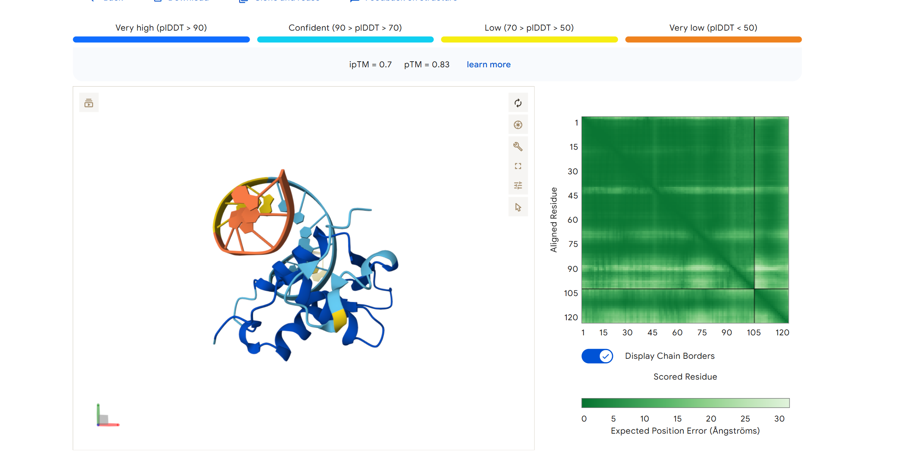
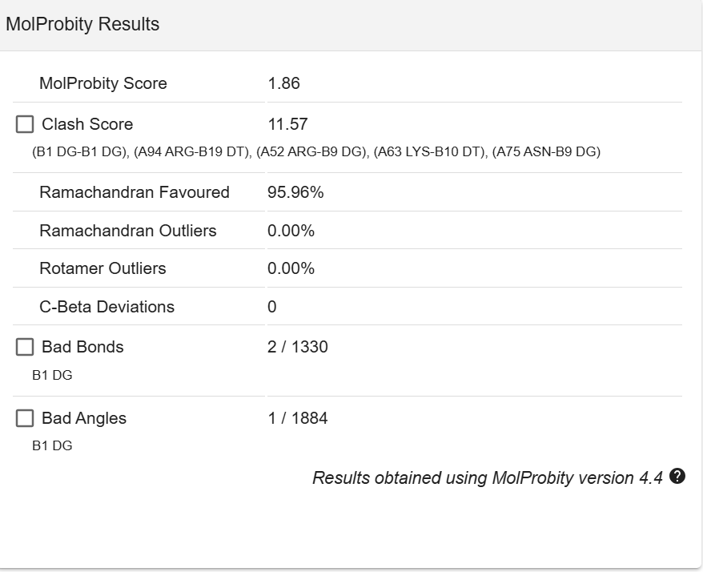
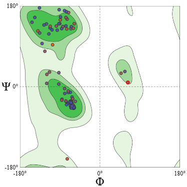
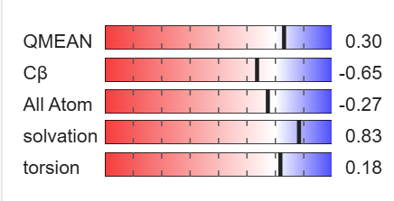
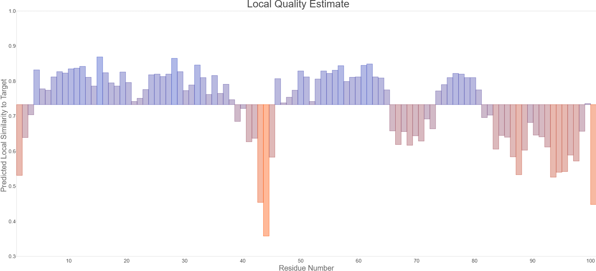

# Complejo FOXD3_RAT-ADN

La proteína FOXD3 (Forkhead Box D3) es un factor de transcripción esencial, fundamental para mantener la pluripotencia en células madre embrionarias y crucial en el desarrollo temprano, específicamente en la formación de la cresta neural . Actúa principalmente como represor transcripcional y funciona como supresor de tumores en varios cánceres.

Secuencia(Q63245 · FOXD3_RAT):
```
LVKPPYSYIALITMAILQSPQKKLTLSGICEFISNRFPYYREKFPAWQNSIRHNLSLNDCFVKIPREPGNPGKGNYWTLDPQSEDMFDNGSFLRRRKRFKR
```

Secuencia consenso de union al ADN:
 ```
  5'-A[AT]T[AG]TTTGTTT-3'
 ```


Analisis de metricas de AlphaFold3

**pTM (Predicted Template Modeling score) y ipTM (Interface pTM)** :

Con un valor de 0.83 y 0.7, se puede decir que es una muy buena prediccion. La topologia global del complejo es confiable, y la confianza de interfaz de union es confiable tambien, sugiriendo que es fisicamente probable que se de el complejo.

**pLTDD :**

El nucleo de la proteina muestra una confianza alta, con una interaccion mayormente en el surco mayor del ADN caracteristico de la familia fork-head a la que pertenence Foxd3, la confianza baja conforme ponemos detalle a los extremos C y N terminal, que pueden representar las colas intrínsicamente desordenadas de los factores de transcripcion, aunque se podria decir que hay baja confianza en la helice de ADN, la geometria parece bien conservada.

**PAE Matrix :**

El dominio de union al ADN es una estructura rigida y predicha con bastante confianza, alta certeza de que la posicion de la proteina con respecto al ADN.

# Análisis de métricas de Swissmodel Asses


### 1. Métricas de Calidad Global





El modelo presenta una estabilidad termodinámica y geométrica bastante buena:

- **QMEAN $Z$-score (0.30):** Un valor cercano a cero indica que la estructura es totalmente consistente con las características de proteínas nativas de alta resolución. La ubicación del modelo en el centro de la distribución de estructuras del PDB confirma la ausencia de anomalías globales.

- **MolProbity Score (1.86):** Esta puntuación refleja una excelente calidad física integral, considerando la ausencia de choques atómicos y una geometría de enlaces optimizada.

- **Clash Score (11.57):** Indica un nivel bajo de superposición atómica no natural, lo que sugiere que el empaquetamiento del dominio de unión al ADN es estéricamente favorable.


### 2. Estereoquímica y Geometría de Residuos






La precisión a nivel atómico se confirma mediante el análisis de los ángulos diedros y las cadenas laterales:

- **Diagrama de Ramachandran:** El **95.96%** de los residuos se encuentran en regiones favorecidas, con un **0.00% de outliers**. Esto garantiza que el esqueleto peptídico (ángulos $\phi$ y $\psi$) del dominio _forkhead_ no presenta tensiones mecánicas.

- **Outliers de Rotámeros (0.00%):** La totalidad de las cadenas laterales están en conformaciones de baja energía, lo cual es crítico para la fidelidad de las interacciones en la interfaz de unión al ADN.

- **C-Beta Deviations (0):** No se detectaron desviaciones en la geometría de los carbonos beta, asegurando la correcta quiralidad de los aminoácidos.


### 3. Evaluación de Calidad Local (QMEANDisCo)


El análisis residuo por residuo muestra una heterogeneidad coherente con la función biológica de la proteína:

- **Núcleo Estructural (DBD):** Las hélices de reconocimiento presentan una confianza local superior a **0.8**, validando la arquitectura del motivo _winged-helix_.

- **Regiones Flexibles:** Se observan descensos en la puntuación local (residuos ~43 y segmento C-terminal), correspondientes a los bucles de las "alas" (wings) y regiones intrínsecamente móviles, lo cual es biológicamente esperado en factores de transcripción.