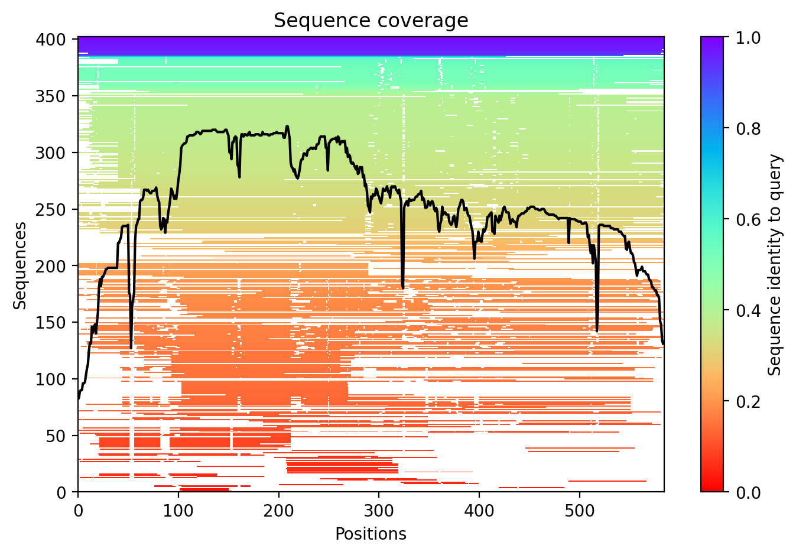
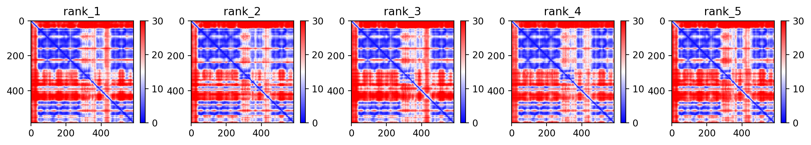
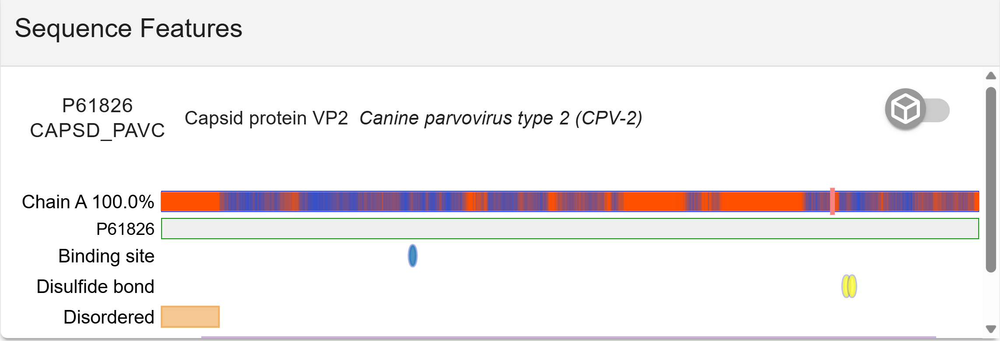
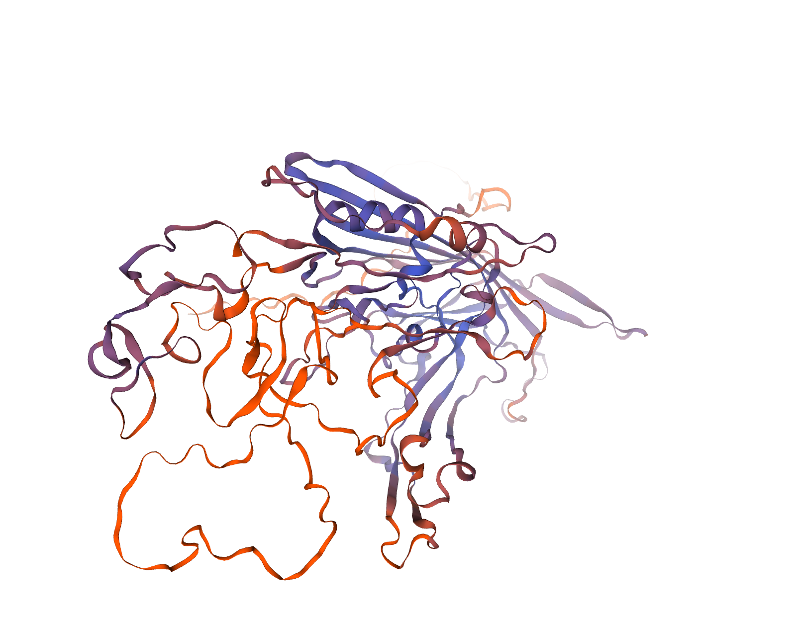
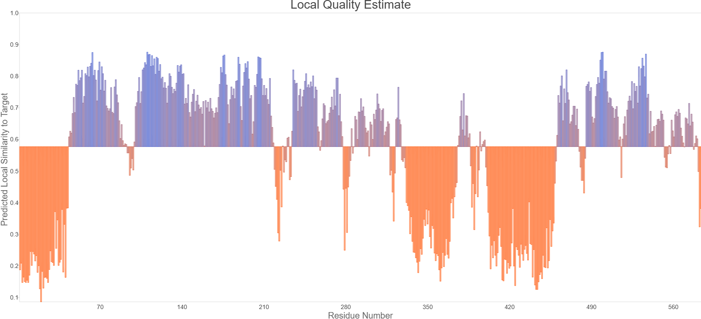
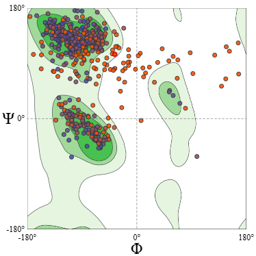

Para este ejercicio se eligió la proteína Capsid protein VP2 del parvovirus canino tipo 2, recuperada en UniProt(P61826 · CAPSD_PAVC) . Con una secuencia de 584 aa:

```
MSDGAVQPDGGQPAVRNERATGSGNGSGGGGGGGSGGVGISTGTFNNQTEFKFLENGWVEITANSSRLVHLNMPESENYRRVVVNNMDKTAVNGNMALDDIHVQIVTPWSLVDANAWGVWFNPGDWQLIVNTMSELHLVSFEQEIFNVVLKTVSESATQPPTKVYNNDLTASLMVALDSNNTMPFTPAAMRSETLGFYPWKPTIPTPWRYYFQWDRTLVPSHTGTSGTPTNIYHGTDPDDVQFYTIENSVPVHLLRTGDEFATGTFFFDCKPCRLTHTWQTNRALGLPPFLNSLPQSEGATNFGDIGVQQDKRRGVTQMGNTNYITEATIMRPAEVGYSAPYYSFEASTQGPFKTPIAAGRGGAQTYENQAADGDPRYAFGRQHGQKTTTTGETPDRITYIAHHDTGRYPEGDWIQNINFNLPVTNDNVLLPTDPIGGKTGINYTNIFNTYGPLTALNNVPPVYPNGQIWDKEFDTDLKPRPHVNAPFVCQHNCPGQLFVKVAPNLTNEYDPDASANMSRIVTYSHFWWKGKLVFKAKLRASHTWNPIQQMSINVDNQFNYVPSNIGGMKIVYEKSQLAPRKLY
```


La proteína de la cápside se auto ensambla para formar una cápside icosaédrica con una simetría T=1, de unos 22 nm de diámetro, y compuesta por 60 copias de dos variantes de tamaño de las proteínas de la cápside, VP1 y VP2, que se diferencian por la presencia de una extensión N-terminal en la proteína menor VP1. La cápside encapsula el ADN monocatenario genómico. Las proteínas de la cápside son responsables de la unión al receptor TFRC de la célula huésped. Esta unión induce la internalización del virión predominantemente a través de la endocitosis de clatrina. La unión a los receptores del huésped también induce reordenamientos de la cápside que conducen a la exposición superficial del extremo N-terminal de la VP1, específicamente su región similar a la fosfolipasa A2 y sus señales de localización nuclear. El extremo N-terminal de la VP1 podría actuar como una enzima lipolítica para romper la membrana endosomal durante la entrada en la célula huésped. El transporte intracitoplasmático implica microtúbulos y la interacción entre las proteínas de la cápside y la dineína del huésped. La exposición de la señal de localización nuclear probablemente permite la importación nuclear de las cápsides (por similitud).

# Analisis de metricas de AlphaFold2




En la grafica de cobertura se muestra que hay una buena profundidad, el núcleo de la proteína (residuos 50 a 550) mantiene una profundidad superior a las 300 secuencias con una identidad moderada-alta. Sugiere que hay suficiente informacion para que la estructura predicha tenga buena confiabilidad.


En el grafico pLDTT podemos ver múltiples picos que superan el umbral de 90, tambien hay regiones con baja confianza, esto se puede deber a la naturaleza de la proteína con estructuras complejas, muy largas o intrínsecamente desordenadas que están involucradas en la patogenicidad del virus.



En las cinco replicas podemos observar coherencia entre ellas, lo que puede indicar confiabilidad y coherencia entre el modelado de la proteína, también las regiones en rojo nos pueden indicar una alta flexibilidad en estas regiones que no permite saber con exactitud la posición de los residuos con respecto a la demás estructura de la proteína.


# Análisis de métricas de Swissmodel Asses





Se logro identificar la secuencia en UniProt a la proteína correcta.




El QMEAN se muestra bastante bajo, debido a la presencia de regiones intrínsecamente desordenadas, que podemos comprobar con el grafico de Sequence Features. El extremo **N-terminal (residuos 1-40)** está marcado explícitamente como **"Disordered"**.


En el grafico de Ramachandran, podemos observar que muestra una buena densidad en las zonas favorecidas , pero hay varios **outliers** (puntos rojos/naranjas). Estos representan aminoácidos cuyos ángulos diedros ($\phi$ y $\psi$) son energéticamente desfavorables. Tambien podemos deducir que hay tensiones geométricas en algunas regiones(N-terminal y algunos bucles).

# Conclusion

Según el análisis de calidad por Swiss-Model Assessment, la puntuación Z de QMEAN fue de -7.02; a pesar de ser baja, esta cifra es coherente con la naturaleza biológica de la proteína VP2. Esta calificación muestra la fuerte penalización de las zonas intrínsecamente desordenadas que se encuentran en el extremo N-terminal (residuos 1-45), las cuales tienen un número elevado de tensiones geométricas (46 enlaces peptídicos retorcidos).

Sin embargo, la evaluación local respalda que el núcleo de la proteína conserva una firme estabilidad estructural, con parámetros geométricos ubicados dentro de los márgenes previstos para el motivo de barril jelly-roll. Es probable que la regiones flexibles sean producto de la naturaleza de la proteína y su dinámica en la cápside, mas que un error de modelado.


